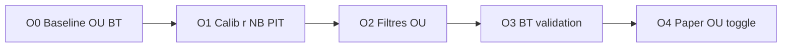

# Plan — Calibrage OU NHL + backtest (style Phase A ML/PL)

## Contexte

- OU **off** aujourd’hui : `NHL_MARCHES_ACTIFS=ML,PL` (surconfiance Under en BT).
- Pipeline OU déjà en place : lambdas → matrice Dixon-Coles + empty-net → **NB** sur totaux (cuts 4.5–7.5) → shrink marché → candidats.
- Knob principal : `nb_ou_dispersion` (`r`, défaut **25**) via `optimiser_nb_ou_dispersion` — **jamais recalibré offline PIT** (meta reste à 25).
- Saison = **paper trading** uniquement ([nhl-paper-trading.mdc](.cursor/rules/nhl-paper-trading.mdc)) : pas de mises réelles ; ML/PL restent le paper trading principal.

**Objectif :** réduire le biais Under / améliorer CLV OU, valider en BT, puis paper trading OU **séparé** — sans polluer ML/PL.

---

## Principe (comme A1–A4)



- **1 BT** après O1 ; **1 BT** après O2 si changé ; pas après chaque micro-ligne env.
- Métrique décision : **CLV OU** d’abord, ROI ensuite.
- Offline calib : **poids uniformes** (désactiver recency MLE 28j comme pour `pl_scale`).
- Fenêtre calib : saisons MoneyPuck **2023–2025** ; **2026 = OOS**.

---

## O0 — Baseline OU (état actuel, r=25)

Sans changer le modèle : activer temporairement OU **uniquement pour le BT**.

```powershell
# env temporaire pour le run (ou flag --marches ML,PL,OU si on l’ajoute)
NHL_MARCHES_ACTIFS=ML,PL,OU
python backtest_nhl.py --simulate --report --saisons 2023,2024,2025,2026 --calib defaults
```

Livrable :
- Table OU : n, WR, ROI, **CLV**, Brier, split Over vs Under, edge moyen.
- Confirmer le diagnostic canvas (Under dominant, Brier élevé).
- **Ne pas** laisser `OU` dans `env/nhl.env` live/paper après ce run.

Critère go O1 : biais Under / CLV OU clairement négatif ou Brier ≫ ML/PL → calib justifiée.

---

## O1 — Calibrer `nb_ou_dispersion` (équivalent A3 `pl_scale`)

Fichiers : [`backtest_nhl.py`](backtest_nhl.py), [`nhl_sniper_omega.py`](nhl_sniper_omega.py) (`optimiser_nb_ou_dispersion`, `_prob_over_under_nb`).

1. Ajouter CLI `--calib-nb-ou` (miroir `--calib-pl-scale`) :
   - Dataset PIT lambdas (réutiliser `_construire_dataset_pl_pit` ou factoriser) saisons 2023–2025.
   - Appeler `optimiser_nb_ou_dispersion` avec **recency off**.
   - Persister `nb_ou_dispersion` dans `rho_calibrage_meta.json` (+ `nb_ou_mse` / n / saisons).
2. BT compare :
   - `--calib defaults` (r=25 env)
   - `--calib frozen` (r calibré meta)
3. Si frozen **pire** en CLV OU (comme pl_scale 0.96) → garder r=25 opérationnel, stocker `nb_ou_brier_opt` en diagnostic seulement.

Sync env : pas de nouvelle clé obligatoire si on réutilise `NHL_NB_OU_DISPERSION_DEFAULT` ; documenter le r choisi dans example si on change le défaut.

**1 backtest** après O1 (OU activé le temps du run).

---

## O2 — Filtres OU (équivalent A1/A2, sans surfit)

Seulement si O1 ne suffit pas (CLV OU encore &lt; 0 ou Under ≫ Over).

Leviers **dans cet ordre** (un seul bloc, puis 1 BT) :

| Levier | Exemple | Pourquoi |
|--------|---------|----------|
| Edge min OU dédié | `NHL_EDGE_MIN_OU=0.05` (si absent → ajouter) | Couper les micro-edges Under surconfiants |
| Bandes OU | `NHL_EDGE_OU_BANDS=…` après diagnostic par bucket | Comme ML, **après** baseline, pas inventées |
| Trust / shrink plus fort sur totaux | option `NHL_OU_TRUST_CAP` ou trust global déjà 0.55–0.80 | Plus de poids Pinnacle sur O/U |

Éviter : filtres post-hoc type « Under interdit » sans preuve multi-saisons.

**1 backtest** après le bloc O2.

---

## O3 — Validation pipeline OU

```powershell
python backtest_nhl.py --simulate --report --saisons 2023,2024,2025,2026 --calib defaults
# avec NHL_MARCHES_ACTIFS=ML,PL,OU le temps du run
```

Critères de succès (paper trading, pas bankroll) :

- CLV OU **≥ 0** (ou clairement meilleur qu’O0)
- Brier OU **≤** baseline O0
- Au moins **3/4 saisons** CLV OU non nettement négatif
- Volume OU raisonnable (pas 2500 Under automatiques)
- ML/PL **ne régressent pas** vs stack paper actuelle (CLV ML/PL stables)

Si échec : OU reste **off** en paper ; documenter limite.

---

## O4 — Paper trading OU (séparé)

Quand O3 OK :

1. Toggle dédié plutôt que tout mélanger : ex. `NHL_MARCHES_ACTIFS=ML,PL` + `NHL_OU_PAPER_ACTIF=true` **ou** second mode / log « shadow OU » (signaux OU en log/CSV sans remplacer le meilleur pari ML/PL).
2. Préférer **shadow** au début : calculer candidats OU, logger CLV live, **ne pas** choisir OU comme seul pari du match tant que n live &lt; ~80–100.
3. `NHL_DRY_RUN=true` inchangé ; gardiens confirmés inchangés.

---

## Hors scope (volontaire)

- Réécriture complète de la matrice / autre famille de modèles totaux
- Cuts hors 4.5–7.5 (sauf si Pinnacle dominant ailleurs)
- Line movement multi-snapshots
- Vraies mises OU

---

## Cadence BT / fichiers

| Étape | Recollecte cotes ? | `--simulate --report` ? |
|-------|--------------------|-------------------------|
| O0 baseline | Non | Oui (OU on le temps du run) |
| O1 `--calib-nb-ou` | Non | Oui defaults + frozen |
| O2 filtres | Non | Oui |
| O3 validation | Non | Oui |
| O4 paper | Non | Non (live dry-run) |

Fichiers touchés prévus : [`backtest_nhl.py`](backtest_nhl.py) (CLI calib + éventuellement `--marches`), [`nhl_sniper_omega.py`](nhl_sniper_omega.py) si trust/edge OU dédié, [`env/nhl.env`](env/nhl.env) + [`env/nhl.env.example`](env/nhl.env.example).

---

## Première action à valider

**O0 ✅ fait (2026-07-20)** — baseline BT OU r=25, GSAx+refs, bandes off :
- OU n=2557 : **2548 Under / 9 Over** ; ROI −2.3% ; CLV **−0.08%** ; Brier 0.274
- Bucket **12–20%** : −2055 u (cœur du biais)
- `env` inchangé : `NHL_MARCHES_ACTIFS=ML,PL`

**O1 ✅ fait (2026-07-20)** — `--calib-nb-ou` PIT 2023–25 :
- MLE : r **25 → 54.4** (NLL ↓ légère ; Brier Over5.5 quasi flat / légèrement pire)
- BT defaults vs frozen : OU frozen **pire** (CLV −0.09, ROI −2.7% vs −0.08 / −2.3%)
- Opérationnel : **r=25** ; `nb_ou_dispersion_opt=54.4` en diagnostic seulement
- Conclusion : la dispersion NB n’est **pas** le levier du biais Under → **O2** (filtres / shrink)

**O2 ✅ fait (2026-07-20)** — filtres OU (indépendants de `BANDS_ACTIF`) :
- `NHL_EDGE_OU_BANDS=3-5,8-12,20-30` (exclut 5–8 et **12–20**, cœur du biais O0)
- `NHL_EDGE_MIN_OU=0.04` ; `NHL_OU_TRUST_CAP=0.50` (shrink totaux)
- BT OU : n **2557 → 1245** ; CLV **−0.08% → +0.00%** ; Brier **0.274 → 0.263** ; ROI **−2.3% → −4.3%**
- Split : **1240 Under / 5 Over** (biais inchangé en proportion)
- Buckets restants : 3–5 / 8–12 / 20–30 tous encore Under-dominated et ROI négatif
- ML/PL stables (CLV +0.09 / +0.55)
- `env` live : `NHL_MARCHES_ACTIFS=ML,PL` (OU toujours off paper)

**O3 ✅ no-go (2026-07-20)** — même run BT que O2 :
- CLV OU = 0 (seuil ≥0 ok) ; Brier mieux qu’O0 ; saisons CLV : +0.15 / −0.18 / +0.13 / −0.03 (pas de catastrophe)
- **Échec** : Under encore ~99.6% ; bucket **8–12%** = −941 u ; ROI −4.3%
- Décision : **OU reste off** en paper (`NHL_MARCHES_ACTIFS=ML,PL`) ; filtres O2 restent en code/env pour un futur modèle
- O4 (shadow paper OU) **non démarré**

---

## M1 — `ou_mu_scale` (fix moyenne, 2026-07-20)

Cause retenue : μ trop bas (pas `r`, pas les bandes). Scale appliqué **uniquement** sur `mu_total` avant NB → ML/PL inchangés.

- CLI : `python backtest_nhl.py --calib-ou-mu-scale --saisons 2023,2024,2025`
- Calib PIT : **1.00 → 1.25** (plafond grille 0.90–1.25) ; Brier Over5.5/6.5 **0.285 → 0.252**
- BT defaults (scale=1) vs frozen (1.25), `MARCHES=ML,PL,OU` le temps du run :

| | defaults (O2) | frozen 1.25 |
|--|---------------|-------------|
| OU n | 1245 | **185** |
| Under / Over | 1240 / 5 (~99.6%) | **107 / 78 (57.8%)** |
| CLV OU | +0.00% | **+0.24%** |
| Brier OU | 0.263 | **0.260** |
| ROI OU | −4.3% | −6.9% |
| ML CLV / PL CLV | +0.09 / +0.55 | +0.08 / +0.56 |

- Saisons CLV OU frozen : S2023 +0.69% ; S2024 −0.37% ; S2025 +0.44% ; S2026 +0.39% (3/4 ≥ 0)
- **Go critères modèle** (split + CLV + Brier + ML/PL) ; ROI encore négatif → pas de vraies mises
- Opérationnel meta : **`ou_mu_scale=1.25`** ; paper O4 : **`NHL_MARCHES_ACTIFS=ML,PL,OU`**
- Suite : grille élargie faite (ci-dessous)

**M1b — grille élargie 0.90–1.50 (2026-07-20)** :
- Opt PIT : **1.26** (Brier 0.252, plateau vs 1.25 — pas de besoin μ≫1.25)
- BT frozen 1.26 vs 1.25 : OU CLV **+0.19%** (vs +0.24), ROI −10.2% (vs −6.9), Brier 0.262 — **légèrement pire**
- Décision : garder **opérationnel 1.25** ; `ou_mu_scale_opt=1.26` diagnostic seulement

**Statut :** biais Under corrigé au niveau μ ; paper OU activé en mix ML/PL (O4).

---

## O4 ✅ paper OU mix (2026-07-20)

- `NHL_MARCHES_ACTIFS=ML,PL,OU` (plus de shadow séparé — choix user)
- `NHL_DRY_RUN=true` inchangé ; `ou_mu_scale=1.25` opérationnel (meta)
- Filtres O2 + modèle M1 actifs ; OU concurrence ML/PL au max-edge, même journal
